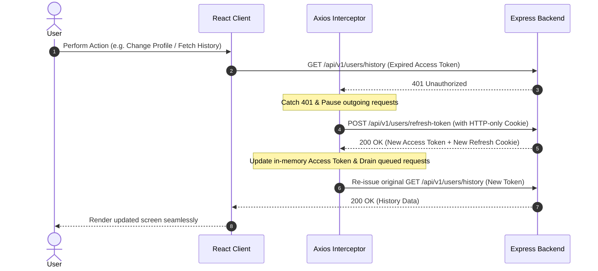

# 🎬 MediaHub Frontend — Modern Video Platform & Creator Studio

> A high-performance, responsive, and visually stunning video sharing client built with **React**, **Vite**, and **Modern CSS**. Designed to integrate seamlessly with the Node.js/Express/MongoDB video backend featuring dual-token JWT rotation, multipart Cloudinary asset uploads, channel metrics, and video streaming.

---

## 📑 Table of Contents
1. [Project Overview & Elevator Pitch](#-project-overview--elevator-pitch)
2. [Tech Stack & Architecture](#-tech-stack--architecture)
3. [Folder Structure & Component Breakdown](#-folder-structure--component-breakdown)
4. [Dual-Token JWT Authentication & Axios Interceptor Flow](#-dual-token-jwt-authentication--axios-interceptor-flow)
5. [Multipart Media Upload & Instant Preview Pipeline](#-multipart-media-upload--instant-preview-pipeline)
6. [Getting Started & Local Development](#-getting-started--local-development)
7. [Frontend Engineer Interview Q&A Cheatsheet (Top 12 Questions)](#-frontend-engineer-interview-qa-cheatsheet)
8. [Performance Optimizations & Core Web Vitals](#-performance-optimizations--core-web-vitals)

---

## 🎯 Project Overview & Elevator Pitch

### ⏱️ How to explain this frontend in an interview (60-second pitch):
> *"MediaHub is a modern, responsive video streaming frontend inspired by YouTube and built with **React and Vite**. Key technical highlights include an **Axios-powered dual-token authentication interceptor** that automatically catches 401 Unauthorized responses, triggers refresh token rotation via secure HTTP-only cookies, and replays failed requests seamlessly without interrupting the user experience; an **asynchronous multipart upload pipeline** supporting instant client-side blob previews for avatar and channel cover images before Cloudinary dispatch; **optimistic UI updates** for channel subscriptions and likes; and a **fluid cinema video player modal** with interactive watch history tracking and comments. The interface is styled with a custom white + light green design system utilizing CSS custom properties, backdrop blur glassmorphism, and responsive layout grids."*

---

## 🛠️ Tech Stack & Architecture

| Layer | Technology | Purpose |
| :--- | :--- | :--- |
| **Framework & Core** | React 18+ (Hooks, Context, Portal patterns) | Declarative component UI and reactive state |
| **Build Tool & Bundler**| Vite 8.x | Sub-second HMR, ES module bundling, tree-shaking |
| **HTTP Client** | Axios (configured with `withCredentials: true`) | REST API communication, request/response interceptors |
| **Icons & Visuals** | Lucide React | Modern, tree-shakeable SVG icons |
| **Styling & System** | Modern Vanilla CSS & CSS Custom Properties | Zero-runtime CSS, glassmorphism, fluid typography, dark mode |
| **Typography** | Google Fonts (`Outfit` display + `Inter` body) | Ultra-crisp modern interface typography |

---

## 📂 Folder Structure & Component Breakdown

```plaintext
frontend/
├── index.html                  # HTML5 entry with Google Fonts & SEO metadata
├── vite.config.js              # Vite configuration with API reverse proxy
├── package.json                # Dependencies and build scripts
├── README.md                   # Complete frontend documentation & interview guide
└── src/
    ├── main.jsx                # Application mounting entry point
    ├── App.jsx                 # Root coordinator: global state, view routing, modals
    ├── index.css               # Design system tokens, variables, keyframe animations
    ├── services/
    │   └── api.js              # Axios instance, token interceptors, and typed API service
    ├── data/
    │   └── mockVideos.js       # Seed video catalogue for streaming & fallback demo
    └── components/
        ├── Navbar.jsx          # Top navigation: search bar, status badge, user dropdown
        ├── Sidebar.jsx         # Collapsible navigation drawer (Home, Trending, Library)
        ├── VideoCard.jsx       # Video grid item: duration chip, hover play preview, creator link
        ├── VideoPlayerModal.jsx# Cinema video player, subscribe button, likes, real-time comments
        ├── AuthModal.jsx       # Modal for Sign In & Register with instant image upload preview
        ├── ChannelView.jsx     # Channel banner, subscriber metrics, tabs & uploaded videos
        ├── SettingsModal.jsx   # Profile update, live avatar/cover upload, password reset
        ├── WatchHistoryView.jsx# User watch history viewer with clear-all capability
        └── Toast.jsx           # Global floating notification alerts (success, error, info)
```

---

## 🔐 Dual-Token JWT Authentication & Axios Interceptor Flow

### The Challenge:
Access Tokens are deliberately short-lived (e.g., 15 minutes to 1 day) to limit vulnerability windows if intercepted. When an Access Token expires during active user sessions, rejecting the request and redirecting the user to `/login` creates terrible UX.

### The Solution:
The Axios instance in `src/services/api.js` uses an **Automatic Request Queuing & Token Refresh Interceptor**:



### Key Implementation Details:
1. **`withCredentials: true`**: Instructs the browser to include cross-origin HTTP-only cookies (`refreshToken`) in requests.
2. **Concurrency Queue (`failedQueue`)**: If multiple API calls fail simultaneously when the token expires, only **one** `/refresh-token` network call is made. All other failed requests are queued and resolved once the single refresh operation succeeds.
3. **Infinite Loop Protection**: Requests to `/login`, `/register`, or `/refresh-token` itself bypass the retry logic to prevent recursive retry loops.

---

## 📸 Multipart Media Upload & Instant Preview Pipeline

When registering or updating user profiles, files must be sent to the Express backend via `multipart/form-data`:

1. **Instant Client-Side Preview**:
   ```javascript
   const handleAvatarChange = (e) => {
     const file = e.target.files?.[0];
     if (file) {
       setAvatarFile(file);
       // Instant blob URL for UI feedback before uploading
       setAvatarPreview(URL.createObjectURL(file));
     }
   };
   ```
2. **FormData Packaging**:
   ```javascript
   const formData = new FormData();
   formData.append('fullName', fullName);
   formData.append('avatar', avatarFile); // matches multer upload.fields([{ name: "avatar" }])
   if (coverFile) formData.append('coverImage', coverFile);
   ```
3. **Dispatch to Backend**: Axios automatically sets `Content-Type: multipart/form-data` with the appropriate boundary string.

---

## 🚀 Getting Started & Local Development

### Prerequisites:
- Node.js **v18+** installed (`node -v`)
- npm **v9+** installed (`npm -v`)

### 1. Start the Backend API (from the project root):
```bash
# In e:\PROGRAME\BackendProject
npm run dev
# Server boots at http://localhost:8080
```

### 2. Start the Frontend Development Server:
```bash
# Open a new terminal in e:\PROGRAME\BackendProject\frontend
cd frontend
npm install
npm run dev
```
The application will launch at **`http://localhost:5173`**.

### 3. Vite Proxy Configuration:
`frontend/vite.config.js` is pre-configured with a reverse proxy:
```javascript
server: {
  port: 5173,
  proxy: {
    '/api': {
      target: 'http://localhost:8080',
      changeOrigin: true,
      secure: false,
    }
  }
}
```
> **Why this matters**: Requests to `/api/v1/...` are made to the same origin (`http://localhost:5173`), eliminating all local browser CORS roadblocks and ensuring cookies are cleanly stored.

---

## 💡 Frontend Engineer Interview Q&A Cheatsheet

Here are the top technical questions senior interviewers ask candidates based on this video streaming & dual-token architecture:

---

### Q1: Where should JWT Access Tokens and Refresh Tokens be stored on the client, and why?
**Answer:**
- **Refresh Tokens** should **always** be stored in **`HttpOnly`, `Secure`, `SameSite=Strict` (or `Lax`) cookies**. Because JavaScript running in the browser cannot read `HttpOnly` cookies, they are completely immune to Cross-Site Scripting (XSS) token theft.
- **Access Tokens** are best stored **in memory** (e.g., inside a JavaScript variable or React state/context) with an optional fallback to `sessionStorage`. Storing access tokens in `localStorage` leaves them vulnerable to malicious third-party dependencies or XSS payloads.
- In this project, the refresh token resides safely in an `HttpOnly` cookie managed by the backend, while the access token is managed in-memory and synchronized with Axios default headers.

---

### Q2: How does the Axios 401 response interceptor work during token expiration, and how do you prevent race conditions with multiple requests?
**Answer:**
When an access token expires:
1. The backend returns a `401 Unauthorized`.
2. The Axios response interceptor intercepts the error before returning to the calling component.
3. We inspect `error.config._retry`. If false, we set `_retry = true`.
4. To solve **race conditions** (where 5 API calls on a page fail at the exact same millisecond):
   - We maintain an `isRefreshing` boolean flag and a `failedQueue` array.
   - The first request sets `isRefreshing = true` and initiates the `/users/refresh-token` API call.
   - Any subsequent requests arriving while `isRefreshing` is true return a pending `Promise` pushed into `failedQueue`.
   - When the refresh call resolves with a new access token, we loop through `failedQueue`, update their `Authorization` header, and replay each one.
   - Finally, we reset `isRefreshing = false`.

---

### Q3: Why does setting `Access-Control-Allow-Origin: *` break when using `withCredentials: true`?
**Answer:**
Under the W3C CORS specification, if an HTTP request includes credentials (`cookies`, `authorization headers`, or TLS client certificates), browsers **strictly prohibit wildcard origins (`*`)** for security reasons.
If a browser allowed `*` with credentials, any malicious website on the internet could initiate credentialed requests on behalf of the user to any internal or authenticated endpoint.
**The Fix:** The backend CORS middleware must dynamically validate and echo back the specific requesting origin (e.g. `http://localhost:5173` or `https://mystreamapp.com`), alongside `Access-Control-Allow-Credentials: true`.

---

### Q4: Explain `URL.createObjectURL(file)` vs `FileReader.readAsDataURL(file)` for instant image upload previews. What are the memory implications?
**Answer:**
- **`URL.createObjectURL(file)`**: Generates a synchronous, compact synthetic URL pointing directly to the file object in the browser’s internal memory (e.g., `blob:http://localhost:5173/uuid`). It is substantially faster, consumes almost no CPU, and does not block the main thread.
  - *Memory gotcha*: Blob URLs persist in browser memory until the document is unloaded. In production apps with frequent uploads, you must call `URL.revokeObjectURL(previewUrl)` inside a `useEffect` cleanup return to prevent client-side memory leaks.
- **`FileReader.readAsDataURL(file)`**: Asynchronously reads the entire file into a Base64-encoded string. Base64 strings are ~33% larger in byte size than the original binary, causing unnecessary RAM consumption and garbage collection spikes when handling large photos.
- **Verdict**: Use `URL.createObjectURL` for immediate thumbnail/avatar previews before upload.

---

### Q5: What is an Optimistic UI update, and how did you implement it for Video Likes and Subscriptions?
**Answer:**
- An **Optimistic Update** updates the client interface immediately upon user interaction (e.g., incrementing subscriber count and turning the Subscribe button grey), *before* the backend network request completes.
- **Benefits**: Eliminates UI lag and makes the application feel instantaneous and snappy.
- **Error Handling (Rollback)**:
  ```javascript
  const handleToggleSubscribe = async () => {
    // 1. Snapshot previous state
    const previousState = isSubscribed;
    const previousCount = subscribersCount;

    // 2. Optimistic immediate render
    setIsSubscribed(!previousState);
    setSubscribersCount(prev => previousState ? prev - 1 : prev + 1);

    try {
      await api.post(`/subscriptions/toggle/${channelId}`);
    } catch (err) {
      // 3. Roll back on network/server failure
      setIsSubscribed(previousState);
      setSubscribersCount(previousCount);
      showToast('Failed to update subscription. Please try again.', 'error');
    }
  };
  ```

---

### Q6: How do you optimize search bar performance so API calls aren't fired on every keystroke?
**Answer:**
By applying **Debouncing**:
Debouncing delays the execution of a search function until a specified time (e.g., 300ms) has elapsed since the user last pressed a key.

**Custom Hook Implementation:**
```javascript
import { useState, useEffect } from 'react';

export function useDebounce(value, delay = 300) {
  const [debouncedValue, setDebouncedValue] = useState(value);

  useEffect(() => {
    const handler = setTimeout(() => setDebouncedValue(value), delay);
    return () => clearTimeout(handler); // Cancels timer if user types again within 300ms
  }, [value, delay]);

  return debouncedValue;
}
```

---

### Q7: How does HTML5 video streaming work with HTTP Byte-Range requests?
**Answer:**
Modern video streaming does not download the entire multi-gigabyte video file before starting playback:
1. When the `<video>` element loads a URL, it issues a request with header: `Range: bytes=0-`.
2. The server responds with HTTP status **`206 Partial Content`**, returning headers:
   - `Content-Range: bytes 0-1048575/52428800`
   - `Accept-Ranges: bytes`
   - `Content-Length: 1048576` (1MB chunk)
3. As the user scrubs the timeline or watches ahead, the browser requests subsequent byte chunks on-demand.
4. For adaptive bitrates (switching 1080p, 720p, 480p based on network speed), **HLS (HTTP Live Streaming)** or **DASH** breaks videos into `.m3u8` playlists and `.ts` segments, which can be rendered in React using `hls.js`.

---

### Q8: How do you prevent Cumulative Layout Shift (CLS) when loading video thumbnails and player frames?
**Answer:**
- **The Problem**: When images or videos load asynchronously without reserved dimensions, the page layout jumps downwards when the image renders, resulting in a poor CLS score.
- **The Fix**:
  1. Use modern CSS `aspect-ratio`:
     ```css
     .video-thumbnail-container {
       width: 100%;
       aspect-ratio: 16 / 9;
       background-color: var(--bg-tertiary); /* Placeholder background */
     }
     ```
  2. Implement **Skeleton Shimmer Screens**: Render placeholder cards with the exact aspect ratio while data is being fetched.
  3. Include `loading="lazy"` on offscreen video thumbnails to save bandwidth.

---

### Q9: How would you monitor and report upload progress for large video files in Axios?
**Answer:**
Axios provides an `onUploadProgress` callback in its request config:
```javascript
const uploadVideo = async (formData, onProgress) => {
  return await api.post('/videos/upload', formData, {
    headers: { 'Content-Type': 'multipart/form-data' },
    onUploadProgress: (progressEvent) => {
      if (progressEvent.total) {
        const percentCompleted = Math.round(
          (progressEvent.loaded * 100) / progressEvent.total
        );
        onProgress(percentCompleted); // updates progress bar state (0 - 100%)
      }
    }
  });
};
```

---

### Q10: What is the difference between client-side routing and server-side routing?
**Answer:**
- **Server-Side Routing**: Every navigation requests an entirely new HTML document from the server. The screen blinks white, all JavaScript state is lost, and the browser re-evaluates the script bundle.
- **Client-Side Routing (SPA)**: The initial HTML and JS bundle are loaded once. Navigation is intercepted via the HTML5 History API (`pushState` / `replaceState` or hash routing). The browser URL changes and the view re-renders without refreshing the page, preserving global state, playback sessions, and cached responses.

---

### Q11: How do you implement infinite scrolling for videos efficiently without degrading DOM performance?
**Answer:**
1. Use an **`IntersectionObserver`** targeted at a sentinel `<div>` placed at the bottom of the video list:
   ```javascript
   useEffect(() => {
     const observer = new IntersectionObserver(([entry]) => {
       if (entry.isIntersecting && hasMore && !isLoading) {
         fetchNextPage();
       }
     }, { threshold: 0.5 });

     if (sentinelRef.current) observer.observe(sentinelRef.current);
     return () => observer.disconnect();
   }, [hasMore, isLoading]);
   ```
2. For feeds containing thousands of items, implement **Virtualization** (e.g. `@tanstack/react-virtual`). Virtualization only mounts DOM nodes for items currently inside the visible viewport, preventing browser memory leaks and frame drops.

---

### Q12: How do you protect a React frontend against Cross-Site Scripting (XSS)?
**Answer:**
1. **Never use `dangerouslySetInnerHTML`** unless HTML strings are rigorously sanitized with libraries like `DOMPurify`.
2. **React's Built-in Escaping**: React automatically escapes all values embedded in JSX `{expression}` as strings, neutralizing `<script>` injection tags.
3. **Avoid JavaScript URIs**: Validate dynamic URLs in `<a href={url}>` to ensure they begin with `http://` or `https://` rather than `javascript:`.
4. **Implement Content Security Policy (CSP)**: Set strict HTTP headers restricting script origins and blocking unauthorized eval expressions.

---

## ⚡ Performance Optimizations & Core Web Vitals

1. **Vite Code Splitting**: Dynamic imports for modals and heavy views to keep initial bundle sizes minimal.
2. **CSS Custom Properties**: Eliminates the overhead of runtime CSS-in-JS style injection libraries.
3. **Lazy Asset Loading**: Images outside the immediate viewport use native `loading="lazy"`.
4. **Hardware Acceleration**: Transitions use `transform` and `opacity` to run on the GPU compositor thread at 60+ FPS.

---

*Crafted for production engineering standards and technical interview excellence.*
